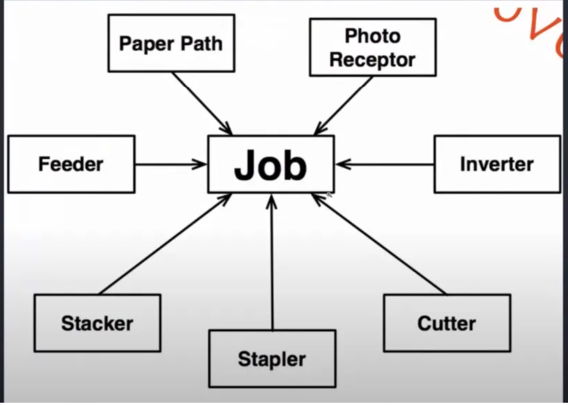
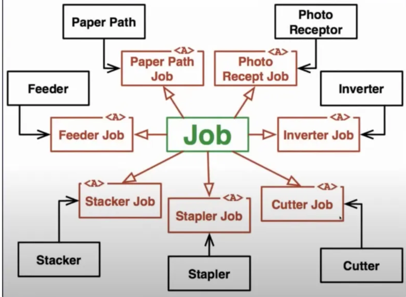

→ Esse princípio nos guia a diminuir o **acoplamento e dependências entre nossos componentes**, **fazendo – os depender somente do que eles realmente precisam.**

*“Nenhum componente deve ser forçado a depender de componentes que ele não precisa.”*

uma interface só deve expor aquilo que é necessário para o contexto determinado.

exemplo ruim de interface:
⚠️ no contexto de produto, também me é exposto os métodos de criação de categoria, e criação de pedido.

⚠️ se eu alterar a assinatura do método `createCategory` as implementações para produto e pedido também precisarão ser ajustadas.

```java
public interface SQLServerRepository {
    void createProduct(object product);
    void createOrder(object order);
    void createCategory(object category);
}
```

Exemplo de problema ao não ter a segregação de interface.
todos dependem de ’Job’. se houver alguma mudança em Job, tudo é alterado.


Exemplo de aplicação de segregação de interface.
